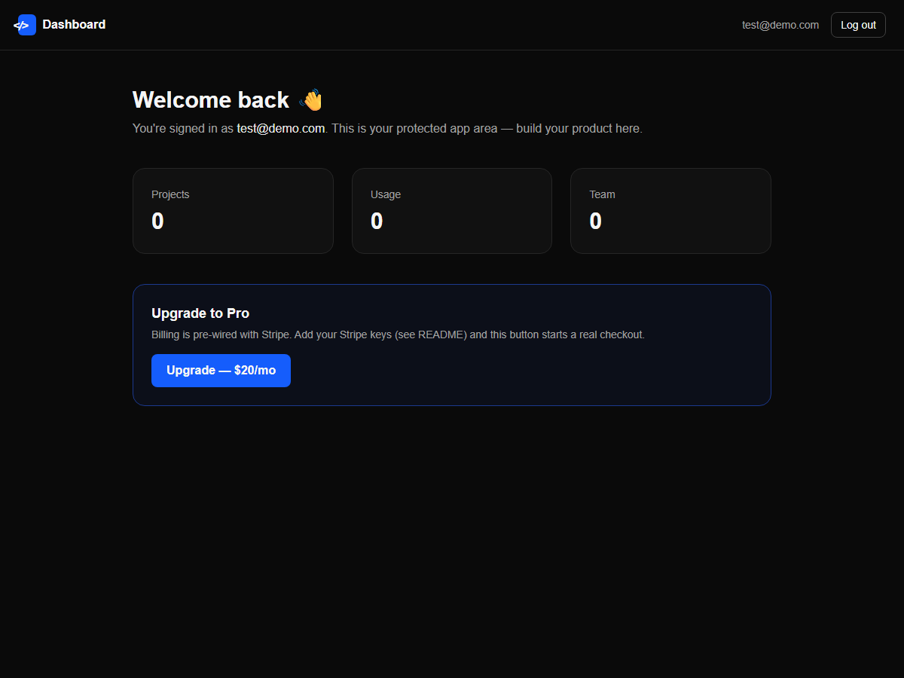

# ⚡ SaaS Starter Kit (Next.js)

> Auth, a protected dashboard, and Stripe-ready billing — already wired up. **Runs instantly, no external services needed to start.** Stop rebuilding the boring 80% of every SaaS.



## Why

Every SaaS needs the same plumbing before you can build the actual product: sign-up, login, sessions, a protected app area, billing. This kit gives you all of it, working, so you start on day one with the interesting part.

## What's inside

- 🔐 **Auth that works** — email + password sign-up, login, signed-cookie sessions, protected routes
- 🧑‍💻 **Dashboard** — a protected app shell to build inside
- 💳 **Stripe-ready billing** — checkout flow pre-wired; add your keys and you're charging
- 🛬 **Landing page** — hero, features, pricing, FAQ
- ⚡ **Runs instantly** — a local user store means zero services to configure to try it
- 🧱 **Next.js (App Router) + TypeScript + Tailwind** — modern, typed, documented

## Quick start

```bash
npm install
npm run dev      # http://localhost:3000
```

Sign up with any email — it just works (data is stored locally in `./data/users.json`).

## Going to production

1. Copy `.env.example` → `.env.local` and set `AUTH_SECRET` (a long random string).
2. **Swap the user store** (`lib/auth.ts`, `readUsers`/`writeUsers`) for your database — Postgres, Supabase, etc. It's ~10 lines.
3. **Enable billing**: set `STRIPE_SECRET_KEY` and `STRIPE_PRICE_ID`. The checkout route (`app/api/checkout/route.ts`) is already wired.
4. Deploy to Vercel / Cloudflare / your own server.

## 🚀 Pro Kit

This free version is a complete, working starter. The **Pro Kit** adds the production playbook most people get stuck on:

- 📘 **Production Playbook** — Stripe subscriptions **+ webhooks**, swap to **Postgres/Supabase**, add **Google/GitHub OAuth**, transactional email, deploy & security hardening — step by step
- 📄 **Commercial license** (use in unlimited client projects) + **free lifetime updates**

👉 **Get the Pro Kit:** https://alphaletgo.gumroad.com/l/niqbam

## License

MIT — free for personal and commercial use. A ⭐ helps others find it.
